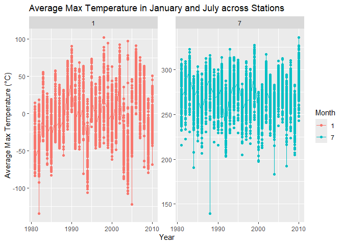
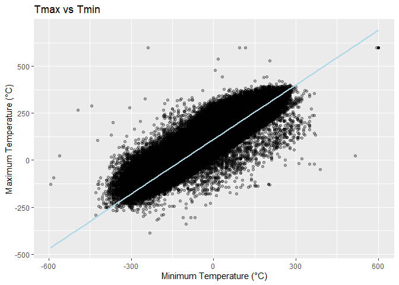
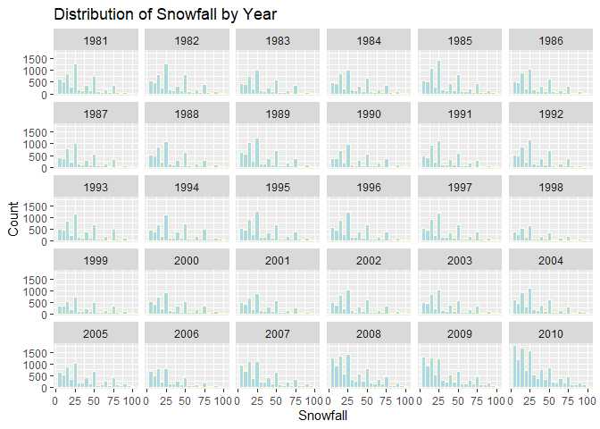
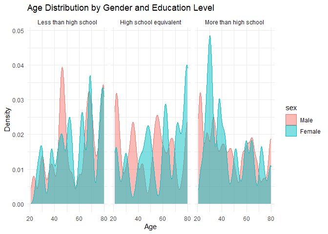
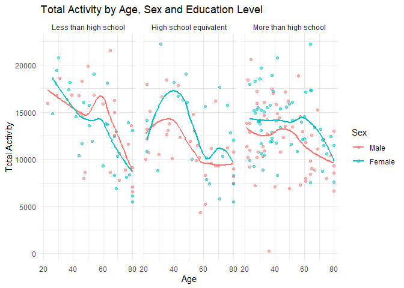
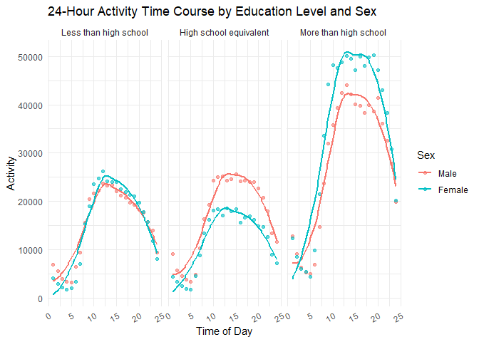

p8105_hw3_lz3014
================
2024-10-14

``` r
library(tidyverse)
```

    ## ── Attaching core tidyverse packages ──────────────────────── tidyverse 2.0.0 ──
    ## ✔ dplyr     1.1.4     ✔ readr     2.1.5
    ## ✔ forcats   1.0.0     ✔ stringr   1.5.1
    ## ✔ ggplot2   3.5.1     ✔ tibble    3.2.1
    ## ✔ lubridate 1.9.3     ✔ tidyr     1.3.1
    ## ✔ purrr     1.0.2     
    ## ── Conflicts ────────────────────────────────────────── tidyverse_conflicts() ──
    ## ✖ dplyr::filter() masks stats::filter()
    ## ✖ dplyr::lag()    masks stats::lag()
    ## ℹ Use the conflicted package (<http://conflicted.r-lib.org/>) to force all conflicts to become errors

# Problem 1

``` r
library(p8105.datasets)
data("ny_noaa")
```

### 1.Write a short description of the dataset.

This dataset contains 2595176 rows and 7 columns, including seven
variables: `id` (weather station id), `date` (date of observation),
`prcp` (total daily precipitation), `snow` (snowfall), `snwd` (snow
depth), `tmax` and `tmin` (min and max temperature).

### 2.Do some data cleaning.

``` r
ny_noaa_clean <- ny_noaa |>
  separate(date, into = c("year", "month", "day"), convert = TRUE) |>
  mutate(tmax = as.numeric(tmax), tmin = as.numeric(tmin))
```

- For snowfall, what are the most commonly observed values? Why? 0 is
  the most commonly observed value for snowfall, because most days of
  the year, it does not snow in NY.

``` r
ny_noaa_clean |>
  count(snow) |>
  arrange(desc(n))
```

    ## # A tibble: 282 × 2
    ##     snow       n
    ##    <int>   <int>
    ##  1     0 2008508
    ##  2    NA  381221
    ##  3    25   31022
    ##  4    13   23095
    ##  5    51   18274
    ##  6    76   10173
    ##  7     8    9962
    ##  8     5    9748
    ##  9    38    9197
    ## 10     3    8790
    ## # ℹ 272 more rows

### 3.Make a two-panel plot showing the average max temperature in January and in July in each station across years.

``` r
ny_noaa_clean |>
  filter(month %in% c(1, 7)) |>
  group_by(id, year, month) |>
  summarise(mean_tmax = mean(tmax, na.rm = TRUE)) |>
  ggplot(aes(x = year, y = mean_tmax, color = as.factor(month))) +
  geom_point() +
  geom_line() +
  facet_wrap(~ month, scales = "free_y") +
  labs(
    title = "Average Max Temperature in January and July across Stations",
    x = "Year",
    y = "Average Max Temperature (°C)",
    color = "Month"
  )
```

    ## `summarise()` has grouped output by 'id', 'year'. You can override using the
    ## `.groups` argument.

    ## Warning: Removed 5970 rows containing missing values or values outside the scale range
    ## (`geom_point()`).

<!-- -->

- Is there any observable / interpretable structure? Any outliers? the
  mean temperature in January is significantly lower than in July across
  all stations and years. Stations generally show similar temperature
  trends over time—when one station records a higher temperature for a
  given year, others tend to follow the same pattern. However, we
  observe an unusually cold station in July of 1987 or 1988, along with
  a few other minor outliers.

### 4.Make a two-panel plot

- 1)  tmax vs tmin for the full dataset (note that a scatterplot may not
      be the best option)

``` r
ny_noaa_clean |>
  ggplot(aes(x = tmin, y = tmax)) +
  geom_point(alpha = 0.3) +
  geom_smooth(method = "lm", color = "lightblue", se = FALSE) + 
  labs(
    title = "Tmax vs Tmin",
    x = "Minimum Temperature (°C)",
    y = "Maximum Temperature (°C)"
  )
```

    ## `geom_smooth()` using formula = 'y ~ x'

    ## Warning: Removed 1136276 rows containing non-finite outside the scale range
    ## (`stat_smooth()`).

    ## Warning: Removed 1136276 rows containing missing values or values outside the scale
    ## range (`geom_point()`).

<!-- -->

- 2)  make a plot showing the distribution of snowfall values greater
      than 0 and less than 100 separately by year.

``` r
ny_noaa_clean |>
  filter(snow > 0, snow < 100) |>
  ggplot(aes(x = snow)) +
  geom_histogram(binwidth = 5, fill = "lightblue", color = "lightyellow") +
  facet_wrap(~ year) +
  labs(
    title = "Distribution of Snowfall by Year",
    x = "Snowfall",
    y = "Count"
  )
```

<!-- -->

# Problem 2

### 1.Load, tidy, merge, and otherwise organize the data sets.

``` r
covar <- read_csv(file = "./data/nhanes_covar.csv", skip = 4, na = c("NA",".","")) |>
  janitor::clean_names() |>
  filter(age >= 21) |>
  drop_na()
```

    ## Rows: 250 Columns: 5
    ## ── Column specification ────────────────────────────────────────────────────────
    ## Delimiter: ","
    ## dbl (5): SEQN, sex, age, BMI, education
    ## 
    ## ℹ Use `spec()` to retrieve the full column specification for this data.
    ## ℹ Specify the column types or set `show_col_types = FALSE` to quiet this message.

``` r
accel <- read_csv(file = "./data/nhanes_accel.csv", na = c("NA",".","")) |>
  janitor::clean_names() |>
  drop_na()
```

    ## Rows: 250 Columns: 1441
    ## ── Column specification ────────────────────────────────────────────────────────
    ## Delimiter: ","
    ## dbl (1441): SEQN, min1, min2, min3, min4, min5, min6, min7, min8, min9, min1...
    ## 
    ## ℹ Use `spec()` to retrieve the full column specification for this data.
    ## ℹ Specify the column types or set `show_col_types = FALSE` to quiet this message.

- merge and tidy

``` r
mims <- covar |>
  left_join(accel, by = "seqn")

mims_tidy <- 
  pivot_longer(
    mims,
    min1:min1440,
    names_to = "mins",
    names_prefix = "min",
    values_to = "accel_min_data"
  ) |>
  mutate(mins = as.numeric(mins))
```

- encode data with reasonable variable classes

``` r
mims_tidy <- mims_tidy |>
  mutate(sex = factor(sex, levels = c(1, 2), 
                      labels = c("Male", "Female")), 
         education = factor(education, levels = c(1, 2, 3), 
                            labels = c("Less than high school", "High school equivalent", "More than high school")))
mims_tidy
```

    ## # A tibble: 328,320 × 7
    ##     seqn sex     age   bmi education               mins accel_min_data
    ##    <dbl> <fct> <dbl> <dbl> <fct>                  <dbl>          <dbl>
    ##  1 62161 Male     22  23.3 High school equivalent     1          1.11 
    ##  2 62161 Male     22  23.3 High school equivalent     2          3.12 
    ##  3 62161 Male     22  23.3 High school equivalent     3          1.47 
    ##  4 62161 Male     22  23.3 High school equivalent     4          0.938
    ##  5 62161 Male     22  23.3 High school equivalent     5          1.60 
    ##  6 62161 Male     22  23.3 High school equivalent     6          0.145
    ##  7 62161 Male     22  23.3 High school equivalent     7          2.10 
    ##  8 62161 Male     22  23.3 High school equivalent     8          0.509
    ##  9 62161 Male     22  23.3 High school equivalent     9          1.63 
    ## 10 62161 Male     22  23.3 High school equivalent    10          1.20 
    ## # ℹ 328,310 more rows

### 2.Produce a reader-friendly table for the number of men and women in each education category

``` r
sex_tb <- mims_tidy |>
  group_by(education, sex) |>
  summarise(n_obs = n()) |>
  knitr::kable()
```

    ## `summarise()` has grouped output by 'education'. You can override using the
    ## `.groups` argument.

``` r
sex_tb
```

| education              | sex    | n_obs |
|:-----------------------|:-------|------:|
| Less than high school  | Male   | 38880 |
| Less than high school  | Female | 40320 |
| High school equivalent | Male   | 50400 |
| High school equivalent | Female | 33120 |
| More than high school  | Male   | 80640 |
| More than high school  | Female | 84960 |

- create a visualization of the age distributions for men and women in
  each education category.

``` r
mims_tidy |>
  ggplot(aes(x = age, fill = sex, color = sex)) + 
  geom_density(alpha = 0.5) +  
  facet_grid(. ~ education) +  
  labs(
    title = "Age Distribution by Gender and Education Level",
    x = "Age",
    y = "Density"
  ) +
  theme_minimal()
```

<!-- -->

**comment:**  
- The `table` shows that the *“Less than high school”* level has the
largest number of participants, and the distribution between men and
women is relatively balanced in *“Less than high school”* and *“More
than high school”*education levels. However, in the “High school
equivalent” group, the number of men is much higher than the number of
women.  
- The density `plot` shows that older individuals are more concentrated
in the “Less than high school” group, while younger and middle-aged
individuals are more evenly distributed in the “More than high school”
group. There are also some gender differences in age distribution,
particularly in the “More than high school” category.

### 3.Traditional analyses of accelerometer data

- create a total activity variable for each participant.

``` r
mims_tidy <- mims_tidy |>
  group_by(seqn, sex, age, education) |>
  mutate(total_activity = sum(accel_min_data, na.rm = TRUE)) |>
  ungroup()
```

- Plot these total activities (y-axis) against age (x-axis). Include a
  trend line or a smooth to illustrate differences.

``` r
# calculate total activity for each person
mims_total_activity <- mims_tidy |>
  group_by(seqn, sex, age, education) |>
  summarise(total_activity = sum(accel_min_data, na.rm = TRUE)) |>
  ungroup()
```

    ## `summarise()` has grouped output by 'seqn', 'sex', 'age'. You can override
    ## using the `.groups` argument.

``` r
mims_total_activity |>
  ggplot(aes(x = age, y = total_activity, color = sex)) + 
  geom_point(alpha = 0.5) +  
  geom_smooth(method = "loess", se = FALSE) +  
  facet_wrap(~ education) + 
  labs(
    title = "Total Activity by Age, Sex and Education Level",
    x = "Age",
    y = "Total Activity",
    color = "Sex"
  ) +
  theme_minimal()
```

    ## `geom_smooth()` using formula = 'y ~ x'

<!-- -->

**Comment:**  
- The plot shows that total activity generally decreases with age,
especially for those with *“Less than a high school”* education level.
In the *“High school equivalent”*, women’s activity show more pronounced
fluctuations. In the *“More than high school”* group, both sexes show
similar trends.In the latter two groups, women are more numerous and
maintain slightly higher activity while in *“Less than a high school”*
men are more numerous than women across most age.

### 4.Make a three-panel plot that shows the 24-hour activity time courses for each education level and use color to indicate sex.

``` r
# calculate 24-hour activity data for each education level and sex
mims_hourly_activity <- mims_tidy |>
  select(seqn, sex, age, education, mins, accel_min_data) |>
  mutate(hour = floor((mins - 1) / 60) + 1) |>
  group_by(seqn, sex, age, education, hour) |>
  summarise(hour_activity = sum(accel_min_data, na.rm = TRUE)) |>
  ungroup()
```

    ## `summarise()` has grouped output by 'seqn', 'sex', 'age', 'education'. You can
    ## override using the `.groups` argument.

``` r
edu_hourly_activity <- mims_hourly_activity |>
  group_by(education, hour, sex) |>
  summarise(edu_total_activity = sum(hour_activity, na.rm = TRUE)) |>
  ungroup()
```

    ## `summarise()` has grouped output by 'education', 'hour'. You can override using
    ## the `.groups` argument.

``` r
edu_hourly_activity |>
  ggplot(aes(x = hour, y = edu_total_activity, color = sex)) +  
  geom_point(alpha = 0.6) + 
  geom_smooth(method = "loess", se = FALSE) +  
  facet_wrap(~ education) + 
  labs(
    title = "24-Hour Activity Time Course by Education Level and Sex",
    x = "Time of Day",
    y = "Activity",
    color = "Sex"
  ) +
  theme_minimal() +
  theme(axis.text.x = element_text(angle = 30, hjust = 1))
```

    ## `geom_smooth()` using formula = 'y ~ x'

<!-- -->

**Describe this graph:**  
- The graph shows clear activity peaks around 11 AM to 5 PM across all
education levels.  
- The *“More than high school”* education level has the highest activity
values, with women being much more active than men.  
- In the *“High school equivalent”* group, men show higher activity than
women.  
- In the *“Less than high school”* level, the activities of men and
women are similar throughout 24 hours.

# Problem 3

### 1.Import, clean, merge and tidy these data

``` r
jan_2020 <- read_csv(file = "./data/Jan 2020 Citi.csv", na = c("NA",".","")) |>
  janitor::clean_names() |>
  drop_na() |>
  mutate(year = "2020", month = "january")
```

    ## Rows: 12420 Columns: 7
    ## ── Column specification ────────────────────────────────────────────────────────
    ## Delimiter: ","
    ## chr (6): ride_id, rideable_type, weekdays, start_station_name, end_station_n...
    ## dbl (1): duration
    ## 
    ## ℹ Use `spec()` to retrieve the full column specification for this data.
    ## ℹ Specify the column types or set `show_col_types = FALSE` to quiet this message.

``` r
july_2020 <- read_csv(file = "./data/July 2020 Citi.csv", na = c("NA",".","")) |>
  janitor::clean_names() |>
  drop_na() |>
  mutate(year = "2020", month = "july")
```

    ## Rows: 21048 Columns: 7
    ## ── Column specification ────────────────────────────────────────────────────────
    ## Delimiter: ","
    ## chr (6): ride_id, rideable_type, weekdays, start_station_name, end_station_n...
    ## dbl (1): duration
    ## 
    ## ℹ Use `spec()` to retrieve the full column specification for this data.
    ## ℹ Specify the column types or set `show_col_types = FALSE` to quiet this message.

``` r
jan_2024 <- read_csv(file = "./data/Jan 2024 Citi.csv", na = c("NA",".","")) |>
  janitor::clean_names() |>
  drop_na() |>
  mutate(year = "2024", month = "january")
```

    ## Rows: 18861 Columns: 7
    ## ── Column specification ────────────────────────────────────────────────────────
    ## Delimiter: ","
    ## chr (6): ride_id, rideable_type, weekdays, start_station_name, end_station_n...
    ## dbl (1): duration
    ## 
    ## ℹ Use `spec()` to retrieve the full column specification for this data.
    ## ℹ Specify the column types or set `show_col_types = FALSE` to quiet this message.

``` r
july_2024 <- read_csv(file = "./data/July 2024 Citi.csv", na = c("NA",".","")) |>
  janitor::clean_names() |>
  drop_na() |>
  mutate(year = "2024", month = "july")
```

    ## Rows: 47156 Columns: 7
    ## ── Column specification ────────────────────────────────────────────────────────
    ## Delimiter: ","
    ## chr (6): ride_id, rideable_type, weekdays, start_station_name, end_station_n...
    ## dbl (1): duration
    ## 
    ## ℹ Use `spec()` to retrieve the full column specification for this data.
    ## ℹ Specify the column types or set `show_col_types = FALSE` to quiet this message.

``` r
citibike_NYC <- bind_rows(jan_2020, july_2020, jan_2024, july_2024) |>
  mutate(weekdays = factor(weekdays, 
                           levels = c("Monday", "Tuesday", "Wednesday", 
                                      "Thursday", "Friday", "Saturday", 
                                      "Sunday"), 
                           ordered = TRUE))
citibike_NYC
```

    ## # A tibble: 99,253 × 9
    ##    ride_id   rideable_type weekdays duration start_station_name end_station_name
    ##    <chr>     <chr>         <ord>       <dbl> <chr>              <chr>           
    ##  1 4BE06CB3… classic_bike  Tuesday     15.3  Columbus Ave & W … E 53 St & Madis…
    ##  2 26886E03… classic_bike  Wednesd…     5.31 2 Ave & E 96 St    1 Ave & E 110 St
    ##  3 24DC5606… classic_bike  Friday       9.69 Columbia St & Riv… Grand St & Eliz…
    ##  4 EEDC1053… classic_bike  Sunday       7.00 W 84 St & Columbu… Columbus Ave & …
    ##  5 2CD4BD4C… classic_bike  Friday       2.85 Forsyth St & Broo… Suffolk St & St…
    ##  6 E18682F9… classic_bike  Sunday      25.5  Allen St & Hester… Atlantic Ave & …
    ##  7 B9B2E896… classic_bike  Sunday       3.65 Lafayette St & Je… Washington Pl &…
    ##  8 DEF8F504… classic_bike  Sunday      38.3  28 Ave & 44 St     Broadway & Kosc…
    ##  9 17D44DA9… classic_bike  Thursday    38.5  Barrow St & Hudso… Emerson Pl & My…
    ## 10 0FD113A3… classic_bike  Tuesday      6.52 Carlton Ave & Par… Emerson Pl & My…
    ## # ℹ 99,243 more rows
    ## # ℹ 3 more variables: member_casual <chr>, year <chr>, month <chr>

**Describe the resulting dataset:**  
- After cleaning and tidying, dataset `jan_2020` has 12398 rows and 9
columns, dataset `july_2020` has 21013 rows and 9 columns, dataset
`jan_2024` has 18799 rows and 9 columns, dataset `july_2024` has 47043
rows and 9 columns.  
- Finally, we combine these four datasets into `citibike_NYC` which has
99253 rows and 9 columns. It has information on Citi Bike rides in New
York City in January 2020, July 2020, January 2024 and July 2024,
including variables named *ride_id*, *rideable_type*, *weekdays*,
*duration* and so on.

### 2.Produce a reader-friendly table showing the total number of rides in each combination of year and month separating casual riders and Citi Bike members.

``` r
rides_num_total <- citibike_NYC |>
  group_by(year, month, member_casual) |>
  summarise(total_rides = n()) |>
  arrange(year, month) |>
  select(year, month, member_casual, total_rides) |>
  knitr::kable()
```

    ## `summarise()` has grouped output by 'year', 'month'. You can override using the
    ## `.groups` argument.

``` r
rides_num_total
```

| year | month   | member_casual | total_rides |
|:-----|:--------|:--------------|------------:|
| 2020 | january | casual        |         980 |
| 2020 | january | member        |       11418 |
| 2020 | july    | casual        |        5625 |
| 2020 | july    | member        |       15388 |
| 2024 | january | casual        |        2094 |
| 2024 | january | member        |       16705 |
| 2024 | july    | casual        |       10843 |
| 2024 | july    | member        |       36200 |

**Comment:**  
-There is a clear seasonal trend, with higher ride counts in July
compared to January across both 2020 and 2024. This suggests that warmer
months have more bike usage.  
- Additionally, member riders consistently outnumber casual riders in
every period, indicating that the Citi Bike system is more frequently
used by regular, subscribed users.
